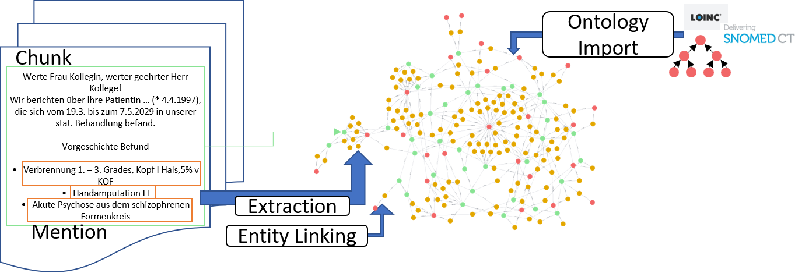

# iPA GraphRAG

## Motivation

This project provides a pipeline to build a GraphRAG system for electronic health records
and to search via the realized GraphRAG system.

## Approach

### GraphRAG Building

The pipeline of building the GraphRAG process consists of the following tasks:

1. **Backend** ```kg_construction/io```: As the backend, we utilize a Neo4j graph database to store the knowledge graph.
As a backend graph, we import several ontologies, along with their concepts and relations. The intention
is to connect the different mentions from the medical documents via the common ontology graph.
Currently, we support the import of the Semantic Network from UMLS to roughly categorize the medical
mentions.
2. **Extraction** ```kg_construction/extraction```: We extract from the documents medical mentions such as medication, diagnoses,
and symptoms. Therefore, we split the document into chunks and use an LLM to extract the mentions
for each chunk. Each chunk is connected to the identified mentions and to the next chunk.
3. **Entity Linking** ```kg_construction/linking```: The goal of the entity linking process is to annotate each mention with a concept from
the backbone knowledge graph. The input of the entity linking process is the unlinked mentions and the
concepts from an ontology. The process stores the determined annotations as edges in the underlying KG.
Currently, we utilize an LLM to determine the annotations for each mention and the corresponding semantic type.
In the future, we aim to support larger ontologies. Therefore, we realize a 
blocking step or indexing to reduce the set of concept candidates.



### GraphRAG Search

We use the GraphRAG system to enable an LLM-based querying with patient-related context information. The main steps of 
using context information with LLMs are the following:

1. **Retrieval** The cornerstone of a GraphRAG system is the identification of relevant context information from the 
knowledge graph. The retrieval methods are located at ```search.retrieval``` package. Currently, we have implemented
a simple node retrieval method identifying the Top5 nodes for a query based on the precalculated text-embeddings.
We further plan the following retrieval methods:
   - **Multi-Hop Retrieval** As starting point, we determine the entity mentions in a query. The identified mentions are
   used to determine the Top1 similar nodes for each mention. We use the identified nodes to determine a mulit-hop graph
   for each node. The subgraphs are then merged to a unified context graph.
   - **Subgraph-Matching Retrieval** Similar to Multi-Hop Retrieval, we extract the mentions from the query. Additionally, 
we identify potential relationships among the mentions and use them to build the subgraph related to the query.
The subgraph is then used to identify the relevant subgraphs from the patient graph. 
2. **Context generation** The retrieved graph is transformed to a JSON representation. In the current version, we do not use 
any confidence scores to rank the context information.
3. The original query and the generated context are used to query an LLM. The task of the LLM is to generate a free text
answer and to provide evidence represented by original text chunks.


## Setup

1. Install the virtual environment:
    ```bash
    uv sync
    ```

2. Create a `.env` file containing all needed environment variables.
    For reference, check out [the example file](./.env_dummy).

    Hint: Manually set environment variables take precedence over those set in the `.env` file.

3. If you do not have a running Neo4j instance, you can launch one using

    ```bash
   
    docker compose -f ./neo4j_iPA/docker-compose.yml up
    ```
### KG Construction commands

- Import the semantic network as backbone ontology. The `NEO4J_URI`, `NEO4J_USER` and `NEO4J_PASSWORD` have to
be defined in the `.env` file
```bash
   uv run ./src/ipagraphrag/main/backend_graph/ontology_import_main.py --srdef_path ./data/sn_current/2023AA/SRDEF --srstre1_path ./data/sn_current/2023AA/SRSTRE1
```

- Extract entity mentions from a patient document using an LLM specified in `.env` by `LLM_MODEL`. We utilize
an API located at `LLM_STUB_URL`.
```bash
   
    uv run ./src/ipagraphrag/main/extraction/llm_extraction_main.py -i ./data/graSSCo
   ```

- Generate embeddings for each node based on the textual properties using a pretrained
language model specified in the `.env` file for the property `LM_MODEL`
```bash
   
    uv run ./src/ipagraphrag/main/embedding_generator/embedding_generator_main.py
   ```
